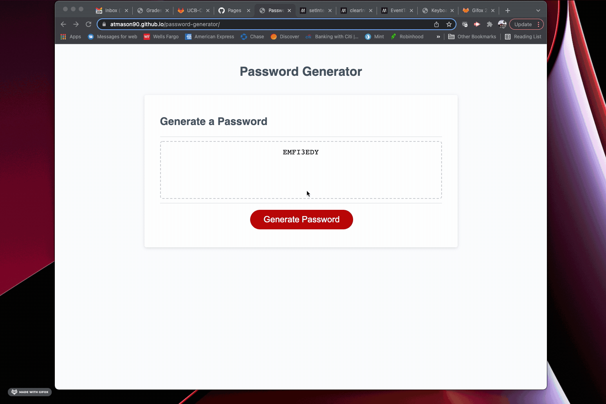

# Password Generator

## The Purpose of This Project

The purpose of this project was to create an application that enables a user to generate a random password that meets a set of predefined criteria for number of characters, inclusion of upper case letters, inclusion of lower case letters, inclusion of special characters, and inclusion of numbers. The goal was to write that application so that the user would be required specify a number of characters between 8 and 128, then confirm at least one of the other criteria to be included in their randomly generated password.

Working from starter code that included very basic HTML and CSS files, I used javascript to power the application in the browser. I used a variety of different tools to execute this project including: functions, if/else if/else statements, and for loops.

## Code Examples

This example shows the part of a javascript function that collected user inputs.
```js
function generatePassword (){
  //prompt for password length
  var passwordLength = prompt("How many characters would you like your password to be?", "must be between 8 and 128 characters");
      //if not a number, alert
    if(isNaN(passwordLength)){
      alert("You must enter a number between 8 and 128");
      //return to generate password
      return generatePassword();
    
      //if not between 8-128, alert
    } else if(passwordLength < 8 || passwordLength > 128){
      alert("must be between 8 and 128 characters");
      //return to generate password
      return generatePassword();
    } else {
      //ask for character types
      var hasUpperCase = confirm("Do you want to include upper case letters?");
      var hasLowerCase = confirm("Do you want to include lower case letters?");
      var hasSpecialChar = confirm("Do you want to include special characters?");
      var hasNumbers = confirm("Do you want to include numbers?");
    }
```

This example shows how I utilized a for loop to generate the random password.
```js
//create variable for final password
    var finalPassword = [];

    //for loop to randomly generate password based on user inputs
    for(var i = 0; i < passwordLength; i++) {
      var randomOutput = userCharChoices[Math.floor(Math.random() * userCharChoices.length)];
      finalPassword.push(randomOutput);
    }

    var password = finalPassword.join("");
    return password;
```

## Demo



## Links


## License


## References


## Technologies Used

